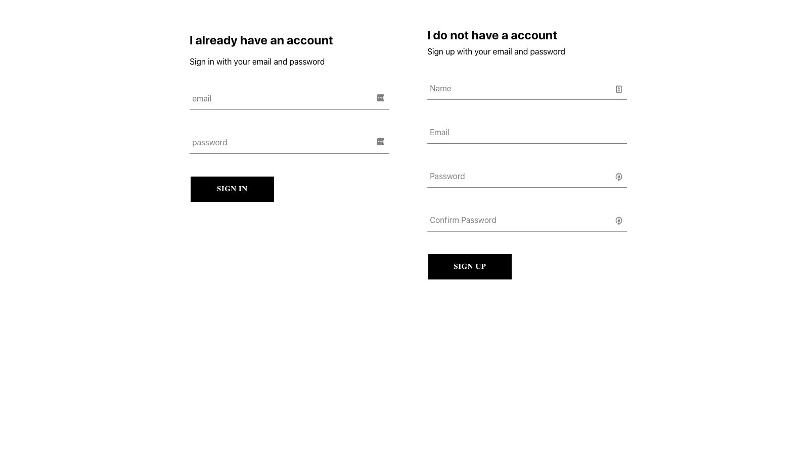

# MyHome-Web Application

A Web application which helps people manage their apartment.

## Screenshots

## Prerequisites

* npm
* You will need backend for this application. Backend is 

## Installing

1. Download the Project to local drive
2. Run `npm start`

## Authors

* [Prathab Murugan](https://github.com/jmprathab)

## License

This project is licensed under the Apache License - see the [LICENSE.md](LICENSE.md) file for details

## Contribution

Feel free to contribute to the project. Please make sure to follow the below list before contributing.

* Read `CODE_OF_CONDUCT.md`
* This project uses coding style from https://github.com/square/java-code-styles
* Make sure all test cases pass before requesting for a PR.

## Acknowledgments

This project relies on the following projects

* React
