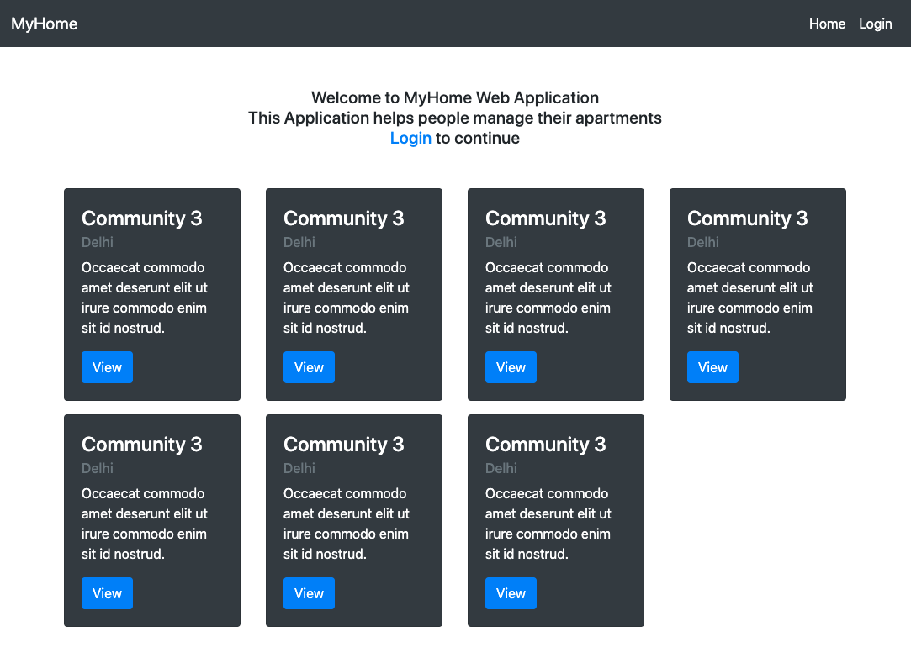

# MyHome-Web Application

A React+Bootstrap Web application which helps people manage their apartment. Spring boot based backend for the application is [here](https://github.com/jmprathab/MyHome).

## Screenshots

## Installing

## Prerequisites

- npm
- You will need backend for this application. Backend is [here](https://github.com/jmprathab/MyHome)

## Building

1. Download the Project to local drive
2. Run `npm install`
3. Run `npm start`

## Contributors

Made with [contributors-img](https://contributors-img.firebaseapp.com)

## How do I contribute?

Feel free to contribute to the project. Please make sure to follow the below list before contributing.

- Read [CONTRIBUTING.md](CONTRIBUTING.md) file for details.

## License

This project is licensed under the Apache License - see the [LICENSE.md](LICENSE.md) file for details.

## Acknowledgments

This project relies on the following projects

- Reactjs
- Bootstrap

## Generating frontend client for OpenAPI specs
1. Run `npm run generator-install` 
   Needs to be done once (it installs openapi-generator-cli globally)
2. Run `npm run generator-generate`
   This command runs `openapi-generator-cli` using config located under `src/client/javascript_generator_config.json` and actual `api.yaml` definition located under [this location](https://raw.githubusercontent.com/jmprathab/MyHome/master/api/src/main/resources/public/swagger/api.yaml).
3. You should see the generated code under `src/client` directory.